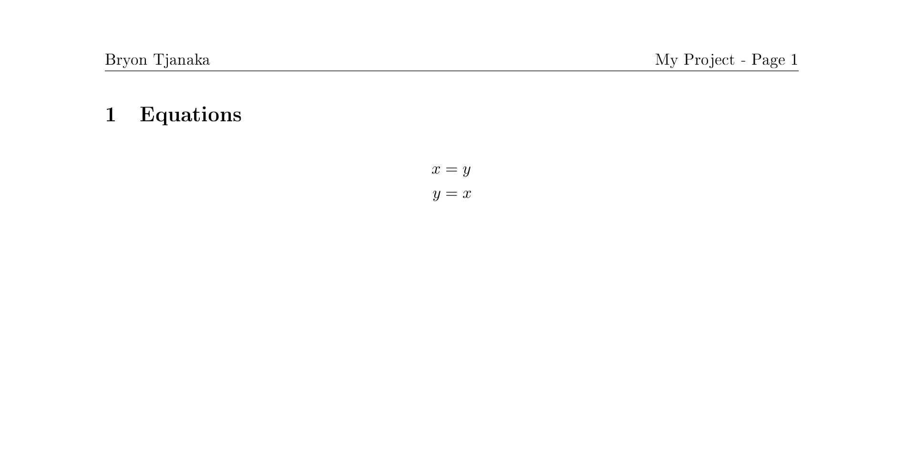
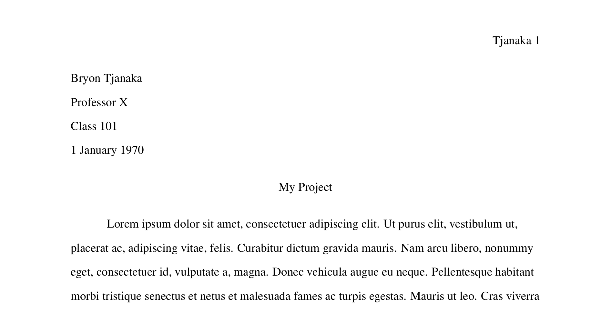
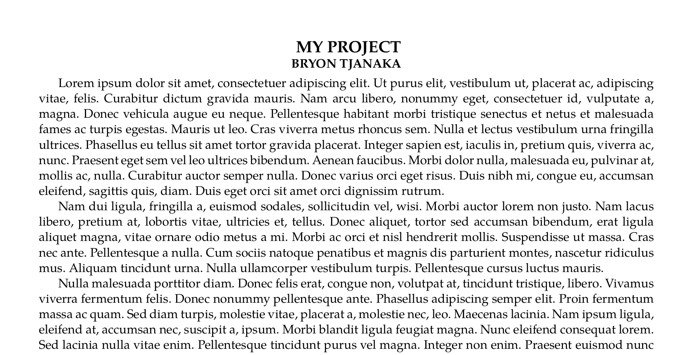

# Latex Cookiecutter

A [Cookiecutter](https://cookiecutter.readthedocs.io/en/latest/) template for
various (simple) school-related Latex projects.

## Dependencies

- latexmk
- pdflatex
- xelatex

## Usage

Once you have Cookiecutter installed, simply run:

```
cookiecutter https://github.com/btjanaka/latex-cookiecutter
```

## Templates

All templates are equipped with a Makefile that uses `latexmk` to continuously
build the document and `evince` to display it.

- `Homework`: Usually for math or theory classes
  
- `MLA`: MLA format for English classes 
- `Simple Essay`: single-spaced essay with title and author at top
  
