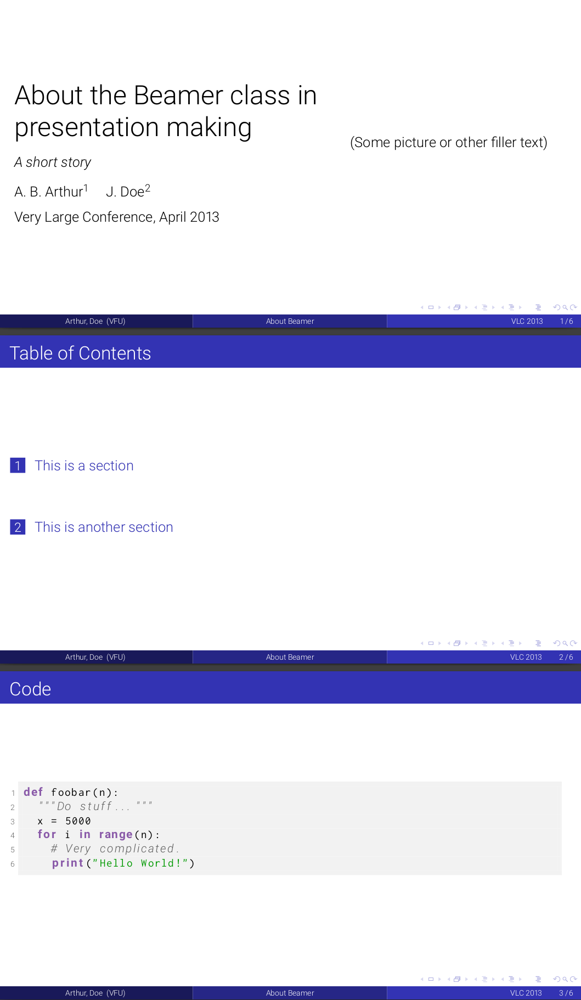

# Latex Cookiecutter

A [Cookiecutter](https://cookiecutter.readthedocs.io/) template for
various simple Latex projects.

## Contents

<!-- vim-markdown-toc GFM -->

* [Dependencies](#dependencies)
* [Usage](#usage)
* [Templates](#templates)
  * [Homework](#homework)
  * [Presentation](#presentation)
  * [MLA](#mla)
  * [Simple Essay](#simple-essay)

<!-- vim-markdown-toc -->

## Dependencies

- latexmk
- pdflatex
- xelatex

## Usage

Once you have [Cookiecutter](https://cookiecutter.readthedocs.io/) installed,
run:

```
cookiecutter https://github.com/btjanaka/latex-cookiecutter
```

## Templates

All templates are equipped with a Makefile that uses `latexmk` to continuously
build the document and `evince` to display it.

### Homework

Usually for math or theory classes.


### Presentation

A [beamer](https://www.overleaf.com/learn/latex/Beamer) presentation originally
based on the Madrid theme.



### MLA

MLA format for English classes


### Simple Essay

Single-spaced essay with title and author at top.


